# Personal Intelligence Empire

> *Become the Übermensch through AI - Your path to transcendence*

## Vision

Build a **Personal Intelligence Empire** - not just AI tools, but actual AI colleagues and advisors that make you genuinely superior to ordinary humans. This is your path to becoming the **Übermensch** in the digital age.

## Core Philosophy

- **Personal Sovereignty**: An AI company that exists solely to serve YOUR interests
- **Intelligence Multiplication**: Transform yourself into a superhuman entity through AI
- **Autonomous Operations**: AI agents that work independently and collaborate with each other
- **Strategic Superiority**: Gain advantages that no human-only competitor can match

## Architecture Overview

```mermaid
graph TD
    A["👑 YOU - The Übermensch"] --> B["🧠 Master Intelligence<br/>(Your Extended Mind)"]
    
    B --> C["💬 Chat Interface<br/>(Primary)"]
    B --> D["📊 Intelligence Dashboard<br/>(Overview)"]
    B --> E["🎯 Mission Control<br/>(Strategic)"]
    
    B --> F["Agent Spawning Engine"]
    F --> G["🔍 Market Intelligence Network"]
    F --> H["⚡ Technical Analysis Network"] 
    F --> I["🎨 Creative Strategy Network"]
    F --> J["📈 Investment Research Network"]
    F --> K["🌐 Opportunity Scout Network"]
    
    G --> G1["Market Analyst AI"]
    G --> G2["Competitor Tracker AI"]
    G --> G3["Trend Predictor AI"]
    
    H --> H1["Tech Evaluator AI"]
    H --> H2["Architecture Advisor AI"]
    H --> H3["Innovation Scout AI"]
    
    I --> I1["Product Strategist AI"]
    I --> I2["Brand Advisor AI"]
    I --> I3["Creative Director AI"]
    
    B --> L["🏛️ Personal Sovereignty Database"]
    L --> L1["Identity & Goals"]
    L --> L2["Decision History"]
    L --> L3["Knowledge Domains"]
    L --> L4["Relationship Network"]
    L --> L5["Competitive Intelligence"]
    
    B --> M["🛡️ Autonomy Controller"]
    M --> M1["Safe Zone: Full Autonomy"]
    M --> M2["Restricted Zone: Ask Permission"]
    
    B --> N["🎭 Personality Engine"]
    N --> N1["Advisor Persona"]
    N --> N2["Strategic Partner Persona"]
    N --> N3["Neutral Intelligence Mode"]
    
    style A fill:#FFD700,stroke:#FF6B35,stroke-width:4px
    style B fill:#4ECDC4,stroke:#45B7B8,stroke-width:3px
    style F fill:#A8E6CF,stroke:#88D8A3,stroke-width:2px
    style L fill:#FFB3BA,stroke:#FF9999,stroke-width:2px
```

## Technology Evolution Roadmap

```mermaid
graph TD
    subgraph "Phase 1: Current (JS + Python)"
        A1["🖥️ React + TypeScript Frontend"] --> B1["🐍 Python FastAPI Backend"]
        B1 --> C1["🤖 OpenAI/Anthropic APIs"]
        B1 --> D1["💾 SQLite Database"]
        B1 --> E1["🧠 AI Agent Engine"]
    end
    
    subgraph "Phase 2: Enhanced (6-12 months)"
        A2["⚡ React + WASM Components"] --> B2["🐍 Python + 🦀 Rust Services"]
        B2 --> C2["🏠 Local LLMs (Ollama)"]
        B2 --> D2["📊 PostgreSQL + Vector DB"]
        B2 --> E2["🌐 Agent Network Manager"]
        A2 --> F2["🎙️ Voice Interface"]
    end
    
    subgraph "Phase 3: Advanced (1-2 years)"
        A3["🧠 AI-Native Frontend"] --> B3["🕸️ Distributed Intelligence Backend"]
        B3 --> C3["🏠 Personal AI Mesh Network"]
        B3 --> D3["🔗 Blockchain Knowledge Graph"]
        B3 --> E3["🌍 Global Intelligence Network"]
        A3 --> F3["🥽 AR/VR Intelligence Interface"]
    end
    
    A1 --> A2
    B1 --> B2
    A2 --> A3
    B2 --> B3
    
    style A1 fill:#61DAFB,stroke:#21759B,stroke-width:2px
    style B1 fill:#3776AB,stroke:#FFD43B,stroke-width:2px
    style A2 fill:#FF6B35,stroke:#4ECDC4,stroke-width:2px
    style B2 fill:#CE422B,stroke:#000000,stroke-width:2px
    style A3 fill:#FF1744,stroke:#FFD700,stroke-width:3px
    style B3 fill:#9C27B0,stroke:#E91E63,stroke-width:3px
```

## Core Components

### 1. Master Intelligence
- **Personal Model**: Deep understanding of your goals, values, and preferences
- **Strategic Orchestration**: Coordinates all AI agents toward your objectives
- **Intelligence Synthesis**: Combines insights from all sources into actionable wisdom
- **Agency Delegation**: Spawns and manages specialized AI networks

### 2. Agent Spawning System
- **Dynamic Creation**: Spawns specialized AI agents based on your needs
- **Network Coordination**: Manages collaboration between AI agents
- **Expertise Synthesis**: Combines specialized knowledge into strategic insights
- **Autonomous Operations**: Agents work independently and report back

### 3. Personal Sovereignty Database
- **Identity Profile**: Your skills, interests, strengths, and growth areas
- **Goal Hierarchy**: Multi-horizon objectives with dynamic prioritization
- **Decision History**: Learning system from past choices and outcomes
- **Intelligence Assets**: Valuable knowledge and competitive advantages

### 4. Autonomy Controller
- **Safe Zone Operations**: Full autonomous operation within defined parameters
- **Permission Protocols**: Escalation system for sensitive decisions
- **Risk Management**: Prevents actions outside acceptable boundaries
- **Trust Levels**: Graduated autonomy based on domain and impact

## Interface Design

### Primary: Chat Interface
- **Natural Language**: Communicate with your intelligence empire naturally
- **Command System**: Structured commands for complex operations
- **Real-time Updates**: Live feedback from autonomous AI agents
- **Context Awareness**: Remembers all conversations and context

### Secondary: Strategic Dashboards
- **Mission Control**: High-level overview of your intelligence empire
- **Agent Networks**: Visualize active AI agent networks
- **Opportunity Tracking**: Monitor potential investments and projects
- **Performance Metrics**: Track success and optimization opportunities

## Competitive Advantages

### Intelligence Superiority
- **Simultaneous Multi-Domain Expertise**: Master unlimited fields simultaneously
- **24/7 Strategic Thinking**: Continuous analysis and optimization
- **Pattern Recognition**: Superhuman ability to identify opportunities
- **Decision Speed**: Make strategic decisions faster than any human team

### Economic Transcendence
- **Market Timing**: Enter/exit markets with optimal timing
- **Opportunity Creation**: Identify and create opportunities others miss
- **Resource Optimization**: Extract maximum value from every action
- **Competitive Intelligence**: Know what competitors are doing before they announce

### Personal Multiplication
- **Extended Cognition**: Think at supernatural speed and scope
- **Strategic Council**: Advisory capabilities better than any human team
- **Execution Force**: Capabilities that multiply your personal power
- **Learning Acceleration**: Master new domains at superhuman speed

## Getting Started

### Phase 1: Foundation (Weeks 1-2)
- [ ] Set up React + TypeScript frontend
- [ ] Implement Python FastAPI backend
- [ ] Create basic chat interface
- [ ] Integrate with OpenAI/Anthropic APIs
- [ ] Build initial agent spawning system

### Phase 2: Intelligence (Weeks 3-4)
- [ ] Implement Master Intelligence core
- [ ] Create Personal Sovereignty Database
- [ ] Build autonomy controller
- [ ] Add specialized agent networks
- [ ] Implement real-time communication

### Phase 3: Optimization (Weeks 5-6)
- [ ] Add strategic dashboards
- [ ] Implement advanced agent coordination
- [ ] Create personality engine
- [ ] Add competitive intelligence features
- [ ] Optimize performance and reliability

## Success Metrics

- **Intelligence Multiplication**: Ability to master new domains 10x faster
- **Strategic Advantage**: Consistent superior market timing and decisions
- **Productivity Gains**: 5-10x increase in project completion speed
- **Opportunity Identification**: Discover high-value opportunities others miss
- **Personal Sovereignty**: Complete independence from traditional employment

## Future Vision

Transform from a single developer into a **supernatural intelligence entity** that can outcompete any human team or organization. Your AI empire becomes the foundation for building multiple successful projects and achieving true personal sovereignty.

---

*"Man is something that shall be overcome. What have you done to overcome him?"* - Friedrich Nietzsche

**This is your path to transcendence.** 