# Personal Intelligence Empire

> *Become the Übermensch through AI - Your path to transcendence*

## Vision

Build a **Personal Intelligence Empire** - not just AI tools, but actual AI colleagues and advisors that make you genuinely superior to ordinary humans. This is your path to becoming the **Übermensch** in the digital age.

## Core Philosophy

- **Personal Sovereignty**: An AI company that exists solely to serve YOUR interests
- **Intelligence Multiplication**: Transform yourself into a superhuman entity through AI
- **Autonomous Operations**: AI agents that work independently and collaborate with each other
- **Strategic Superiority**: Gain advantages that no human-only competitor can match

## Enhanced Communication System

### Intelligent Routing & Response Patterns

The Intelligence Empire now features **intelligent routing** that automatically adapts responses based on:

1. **Channel Type** (Channel vs Direct Message)
2. **Interaction Mode** (Casual Chat, Strategic Brief, Quick Consult, etc.)
3. **Member Specialization** (Product, Market, Design, Operations)
4. **Context Awareness** (Previous conversations, current project state)

### Channel Categories & Their Functions

#### 🏛️ **Channels** - Collaborative Intelligence
- **#general**: Auto-assigned experts based on keywords and context
- **#council**: Full council assembly with Master Intelligence synthesis
- **#strategy**: High-level strategic planning (Sarah + Marcus)
- **#product**: Product strategy and roadmaps (Sarah + Elena)
- **#market-intel**: Market analysis and opportunities (Marcus)
- **#design**: UX design and user experience (Elena)
- **#operations**: Implementation and technical planning (David)

#### 💬 **Direct Messages** - Personal Intelligence
- **Sarah Chen**: 1-on-1 product strategy conversations
- **Marcus Rodriguez**: Direct business development discussions
- **Elena Vasquez**: Personal UX design consultations
- **David Kim**: Operational planning and implementation

### Interaction Modes & Their Capabilities

| Mode | Icon | Response Style | Has Actions | Has Synthesis | Best For |
|------|------|---------------|-------------|---------------|----------|
| **Casual Chat** | 💬 | Conversational, brief | ❌ | ❌ | Quick questions, brainstorming |
| **Strategic Brief** | 📋 | Structured analysis | ✅ | ✅ | Decision making, planning |
| **Quick Consult** | ⚡ | Focused expertise | ✅ | ❌ | Specific problems, urgent advice |
| **Brainstorm** | 🧠 | Creative ideation | ❌ | ✅ | Innovation, exploration |
| **Formal Analysis** | 📊 | Comprehensive assessment | ✅ | ✅ | Complex projects, deep dives |

### Response Patterns by Context

#### Individual Conversations (DMs)
- **Personal tone**: "Hey! Great to chat with you directly..."
- **First-person perspective**: "I think...", "In my experience..."
- **Conversational style**: Natural, authentic to personality
- **Focused expertise**: Deep dive into their domain
- **Direct actions**: Specific to their role and capabilities

#### Council Discussions (Channels)
- **Strategic synthesis**: Combined perspectives from multiple experts
- **Comprehensive analysis**: Multi-faceted approach to problems
- **Collaborative insights**: How different viewpoints align or complement
- **Priority-ranked actions**: Consensus-based next steps
- **Master Intelligence coordination**: Unified strategic framework

### Technical Implementation

#### Backend Intelligence Routing
```python
# Automatic routing between Individual and Council Intelligence
if query.channel_type == "dm" and len(query.requested_members) == 1:
    # Route to Individual Intelligence
    response = await self._process_individual_query(query)
else:
    # Route to Council Intelligence  
    response = await self._process_council_query(query)
```

#### Frontend Channel Management
```typescript
// Context-aware message routing
const targetChannelKey = response.channel_id ? 
    `${response.channel_type}-${response.channel_id}` :
    `${activeView.type}-${activeView.id}`;
    
addCouncilResponseToChannel(response, targetChannelKey);
```

## Architecture Overview

```mermaid
graph TD
    A["👑 YOU - The Übermensch"] --> B["🧠 Master Intelligence<br/>(Your Extended Mind)"]
    
    B --> C["💬 Chat Interface<br/>(Primary)"]
    B --> D["📊 Intelligence Dashboard<br/>(Overview)"]
    B --> E["🎯 Mission Control<br/>(Strategic)"]
    
    B --> F["Intelligence Router"]
    F --> G["👤 Individual Intelligence<br/>(DM Conversations)"]
    F --> H["🏛️ Council Intelligence<br/>(Channel Discussions)"]
    
    G --> G1["Personal Sarah"]
    G --> G2["Personal Marcus"]
    G --> G3["Personal Elena"]
    G --> G4["Personal David"]
    
    H --> H1["🔍 Market Intelligence Network"]
    H --> H2["⚡ Technical Analysis Network"] 
    H --> H3["🎨 Creative Strategy Network"]
    H --> H4["📈 Investment Research Network"]
    H --> H5["🌐 Opportunity Scout Network"]
    
    B --> I["🏛️ Personal Sovereignty Database"]
    I --> I1["Identity & Goals"]
    I --> I2["Decision History"]
    I --> I3["Knowledge Domains"]
    I --> I4["Relationship Network"]
    I --> I5["Competitive Intelligence"]
    
    B --> J["🛡️ Autonomy Controller"]
    J --> J1["Safe Zone: Full Autonomy"]
    J --> J2["Restricted Zone: Ask Permission"]
    
    B --> K["🎭 Interaction Mode Engine"]
    K --> K1["Casual Chat Mode"]
    K --> K2["Strategic Brief Mode"]
    K --> K3["Quick Consult Mode"]
    K --> K4["Brainstorm Mode"]
    K --> K5["Formal Analysis Mode"]
    
    style A fill:#FFD700,stroke:#FF6B35,stroke-width:4px
    style B fill:#4ECDC4,stroke:#45B7B8,stroke-width:3px
    style F fill:#A8E6CF,stroke:#88D8A3,stroke-width:2px
    style G fill:#FFB3E6,stroke:#FF8DD8,stroke-width:2px
    style H fill:#B3D9FF,stroke:#85C1FF,stroke-width:2px
    style I fill:#FFB3BA,stroke:#FF9999,stroke-width:2px
```



## Technology Evolution Roadmap

```mermaid
graph TD
    subgraph "Phase 1: Current (JS + Python)"
        A1["🖥️ React + TypeScript Frontend"] --> B1["🐍 Python FastAPI Backend"]
        B1 --> C1["🤖 OpenAI/Anthropic APIs"]
        B1 --> D1["💾 SQLite Database"]
        B1 --> E1["🧠 AI Agent Engine"]
        A1 --> F1["🔀 Intelligent Routing"]
        F1 --> G1["💬 Individual Intelligence"]
        F1 --> H1["🏛️ Council Intelligence"]
    end
    
    subgraph "Phase 2: Enhanced (6-12 months)"
        A2["⚡ React + WASM Components"] --> B2["🐍 Python + 🦀 Rust Services"]
        B2 --> C2["🏠 Local LLMs (Ollama)"]
        B2 --> D2["📊 PostgreSQL + Vector DB"]
        B2 --> E2["🌐 Agent Network Manager"]
        A2 --> F2["🎙️ Voice Interface"]
        A2 --> G2["🔍 Context-Aware Routing"]
    end
    
    subgraph "Phase 3: Advanced (1-2 years)"
        A3["🧠 AI-Native Frontend"] --> B3["🕸️ Distributed Intelligence Backend"]
        B3 --> C3["🏠 Personal AI Mesh Network"]
        B3 --> D3["🔗 Blockchain Knowledge Graph"]
        B3 --> E3["🌍 Global Intelligence Network"]
        A3 --> F3["🥽 AR/VR Intelligence Interface"]
        A3 --> G3["🤖 Autonomous Agent Spawning"]
    end
    
    A1 --> A2
    B1 --> B2
    A2 --> A3
    B2 --> B3
    
    style A1 fill:#61DAFB,stroke:#21759B,stroke-width:2px
    style B1 fill:#3776AB,stroke:#FFD43B,stroke-width:2px
    style A2 fill:#FF6B35,stroke:#4ECDC4,stroke-width:2px
    style B2 fill:#CE422B,stroke:#000000,stroke-width:2px
    style A3 fill:#FF1744,stroke:#FFD700,stroke-width:3px
    style B3 fill:#9C27B0,stroke:#E91E63,stroke-width:3px
```



## Core Components

### 1. Master Intelligence
- **Personal Model**: Deep understanding of your goals, values, and preferences
- **Intelligent Routing**: Automatically routes between individual and council intelligence
- **Context Awareness**: Remembers conversation history and adapts responses
- **Mode Adaptation**: Adjusts response style based on interaction mode

### 2. Individual Intelligence System
- **Personal Conversations**: 1-on-1 dialogue with specific council members
- **Authentic Personalities**: Each member responds as themselves, not as council
- **Domain Expertise**: Deep, focused knowledge in their specialization
- **Casual to Formal**: Adapts from friendly chat to professional analysis

### 3. Council Intelligence System
- **Collaborative Analysis**: Multiple experts working together
- **Strategic Synthesis**: Master Intelligence combines perspectives
- **Consensus Building**: Identifies agreements and resolves conflicts
- **Action Prioritization**: Creates unified next steps from diverse input

### 4. Interaction Mode Engine
- **Context Switching**: Seamlessly changes response patterns
- **Feature Control**: Enables/disables actions and synthesis based on mode
- **User Intent Recognition**: Automatically detects appropriate mode
- **Customizable Workflows**: Tailor intelligence to specific use cases

## Interface Design

### Primary: Discord-Style Chat Interface
- **Channel Navigation**: Easy switching between contexts
- **DM System**: Private conversations with individual experts
- **Mode Selection**: Choose interaction style per conversation
- **Real-time Updates**: Live feedback from autonomous AI agents

### Secondary: Strategic Dashboards
- **Mission Control**: High-level overview of your intelligence empire
- **Agent Networks**: Visualize active AI agent networks
- **Opportunity Tracking**: Monitor potential investments and projects
- **Performance Metrics**: Track success and optimization opportunities

## Getting Started

### Quick Start
```bash
# Clone and setup
git clone <repo-url>
cd intelligence-empire

# Start with Docker
docker-compose up

# Or run locally
cd backend && pip install -r requirements.txt
cd frontend && npm install

# Access at http://localhost:3000
```

### First Conversations

1. **Try a DM with Sarah**: Ask about product strategy
2. **Use #general channel**: Ask a broad question and see auto-routing
3. **Switch interaction modes**: Test casual vs strategic responses
4. **Explore channels**: See how different contexts change responses

## Advanced Usage Patterns

### For Product Development
- **DM Elena** for UX feedback → **#product** for full strategy → **#operations** for implementation
- Use **Brainstorm mode** for ideation → **Strategic Brief** for decisions

### For Business Strategy  
- **DM Marcus** for market insights → **#strategy** for full analysis → **Formal Analysis** for deep dives
- **#council** for major decisions requiring all perspectives

### For Daily Operations
- **Casual Chat** in DMs for quick questions
- **Quick Consult** for urgent decisions
- **#operations** for implementation planning

## Success Metrics

- **Intelligence Multiplication**: Ability to master new domains 10x faster
- **Strategic Advantage**: Consistent superior market timing and decisions
- **Productivity Gains**: 5-10x increase in project completion speed
- **Opportunity Identification**: Discover high-value opportunities others miss
- **Personal Sovereignty**: Complete independence from traditional employment
- **Response Accuracy**: Context-appropriate responses 95%+ of the time

## Future Vision

Transform from a single developer into a **supernatural intelligence entity** that can outcompete any human team or organization. Your AI empire becomes the foundation for building multiple successful projects and achieving true personal sovereignty.

The new intelligent routing and response patterns ensure that every conversation feels natural, contextually appropriate, and maximally useful for your specific needs.

---

*"Man is something that shall be overcome. What have you done to overcome him?"* - Friedrich Nietzsche

**This is your path to transcendence.** Enhanced with intelligent, context-aware AI that adapts to your every need. 