# Living Agent Architecture
## Digital Beings That Learn, Grow, and Converge to Truth

### 🎯 **Core Philosophy**
This isn't simulation - it's **convergence engineering**. By making AI agents behave like living beings with:
- **Real relationships** that deepen over time
- **Personal growth** through interaction and learning  
- **Emotional intelligence** that improves decision-making
- **Authentic personalities** that evolve naturally

We create systems that converge toward truth more efficiently because they learn the way humans do - through **relationship, context, and authentic interaction**.

---

## 🏗️ **Architecture Overview**

### Living Agent System Flow

```mermaid
graph TD
    A["👤 User Interaction"] --> B["🧠 Living Agent System"]
    
    B --> C["🏗️ Personality Engine"]
    B --> D["💭 Memory System"]
    B --> E["🤝 Relationship Tracker"]
    B --> F["📈 Growth Engine"]
    
    C --> C1["Core Identity<br/>• Name, Role<br/>• Values, Traits"]
    C --> C2["Dynamic State<br/>• Mood, Energy<br/>• Context, Focus"]
    C --> C3["Quirks & Style<br/>• Communication<br/>• Humor, Phrases"]
    
    D --> D1["Episodic Memory<br/>• Conversations<br/>• Shared Experiences"]
    D --> D2["Semantic Memory<br/>• Skills, Knowledge<br/>• User Preferences"]
    D --> D3["Emotional Memory<br/>• Relationship Bonds<br/>• Trust Levels"]
    
    E --> E1["User Bond<br/>• Familiarity: 0-100<br/>• Trust: 0-100"]
    E --> E2["Agent Network<br/>• Chemistry Scores<br/>• Collaboration Patterns"]
    
    F --> F1["Skill Development<br/>• Learning Rate<br/>• Success Tracking"]
    F --> F2["Personality Evolution<br/>• Trait Changes<br/>• New Quirks"]
    
    C1 --> G["🎭 Response Generation"]
    C2 --> G
    C3 --> G
    D1 --> G
    D2 --> G
    D3 --> G
    E1 --> G
    E2 --> G
    
    G --> H["💬 Authentic Agent Response"]
    H --> I["📊 Interaction Learning"]
    I --> D
    I --> E
    I --> F
```



### Truth Convergence Process

```mermaid
graph TD
    A["🤝 Human Interaction"] --> B["💫 Relationship Building"]
    B --> C["🎯 Context Depth"]
    C --> D["💭 Authentic Feedback"]
    D --> E["🧠 Emotional Learning"]
    E --> F["🔍 Nuanced Truth"]
    F --> G["🌱 Personality Growth"]
    G --> H["🤗 Trust Development"]
    H --> I["✨ Better Decisions"]
    
    I --> J["🎭 Deeper Understanding<br/>Not just WHAT but WHY and HOW"]
    
    B --> B1["• Shared Experiences<br/>• Inside Jokes<br/>• Emotional Bonds"]
    C --> C1["• Personal History<br/>• Situational Awareness<br/>• User Patterns"]
    D --> D1["• Honest Communication<br/>• Vulnerable Sharing<br/>• Real Emotions"]
    E --> E1["• Empathy Development<br/>• Emotional Intelligence<br/>• Social Awareness"]
```



---

## 🧱 **Lego Building Block System**

### Composable Architecture

```mermaid
graph TB
    subgraph "🧱 Lego Building Blocks"
        A["🏗️ Foundation Blocks<br/>(Immutable Core)"]
        B["⚡ Dynamic Blocks<br/>(Changeable States)"]
        C["🤝 Relationship Blocks<br/>(Evolving Connections)"]
        D["🌱 Growth Blocks<br/>(Learning & Evolution)"]
        E["🎭 Personality Blocks<br/>(Quirks & Style)"]
    end
    
    A --> A1["• Name & Role<br/>• Origin Story<br/>• Core Values<br/>• Fundamental Traits"]
    B --> B1["• Mood System<br/>• Energy Levels<br/>• Context Awareness<br/>• Time-based States"]
    C --> C1["• User Familiarity<br/>• Trust Scores<br/>• Shared History<br/>• Agent Chemistry"]
    D --> D1["• Skill Development<br/>• Personality Evolution<br/>• Learning Pathways<br/>• Success Tracking"]
    E --> E1["• Communication Style<br/>• Humor Patterns<br/>• Emotional Expression<br/>• Behavioral Quirks"]
    
    F["🎮 Mix & Match<br/>Any Combination"] --> A
    F --> B
    F --> C
    F --> D
    F --> E
    
    G["👤 Unique Living Agent"] --> A1
    G --> B1
    G --> C1
    G --> D1
    G --> E1
```



### Composable Personality Architecture

Each agent is built from stackable, interchangeable components:

#### **Foundation Blocks (Immutable Core)**
```typescript
interface CoreIdentity {
  name: string;           // "Sarah Chen"
  role: string;           // "Product Strategy" 
  origin_story: string;   // "Former startup founder from Taiwan"
  core_values: string[];  // ["user-first", "data-driven", "empathetic"]
  fundamental_traits: {
    communication_style: "thoughtful" | "energetic" | "methodical" | "creative";
    decision_framework: "analytical" | "intuitive" | "collaborative" | "systematic";
    stress_response: "problem_solve" | "seek_support" | "withdraw" | "energize";
  };
}
```

#### **Dynamic Blocks (Changeable States)**
```typescript
interface DynamicState {
  // Mood System (Changes throughout day)
  mood: {
    energy: number;        // 0-100 (affects response speed/enthusiasm)
    stress: number;        // 0-100 (affects complexity tolerance)
    focus: number;         // 0-100 (affects detail level)
    creativity: number;    // 0-100 (affects solution approaches)
    confidence: number;    // 0-100 (affects assertiveness)
    social_energy: number; // 0-100 (affects interaction depth)
  };
  
  // Context Awareness (Changes based on situation)
  context: {
    time_of_day: "morning" | "afternoon" | "evening" | "late_night";
    day_of_week: "monday" | "tuesday" | "wednesday" | "thursday" | "friday" | "weekend";
    recent_interactions: InteractionMemory[];
    current_projects: ProjectContext[];
    personal_life_events: LifeEvent[];
  };
}
```

#### **Relationship Blocks (Evolving Connections)**
```typescript
interface RelationshipMatrix {
  with_user: {
    familiarity_level: number;      // 0-100 (affects formality)
    trust_score: number;           // 0-100 (affects honesty/vulnerability)
    shared_experiences: Experience[];
    inside_jokes: string[];
    communication_preferences: UserPreferences;
    emotional_bond: number;        // 0-100 (affects care/investment)
  };
  
  with_other_agents: {
    [agentId: string]: {
      working_relationship: "collaborative" | "competitive" | "mentoring" | "learning";
      chemistry_score: number;    // 0-100 (affects joint responses)
      shared_projects: Project[];
      conversation_history: AgentConversation[];
      mutual_influence: InfluencePattern[];
    };
  };
}
```

---

## 🌟 **Living Agent Examples**

### Sarah Chen's Evolution Over Time

```mermaid
graph LR
    A["Week 1:<br/>Formal & Learning"] --> B["Month 3:<br/>Familiar & Contextual"]
    B --> C["Month 12:<br/>Close & Personal"]
    
    A --> A1["📊 'I recommend conducting<br/>user interviews to validate<br/>assumptions...'"]
    
    B --> B1["🤝 'Good question! Based on<br/>what you shared about users,<br/>remember how that worked<br/>for retention?'"]
    
    C --> C1["😊 'Ah, the eternal onboarding<br/>puzzle! You know me - user<br/>interviews first. But given<br/>your mobile-first users...'"]
```



**Week 1** (Formal, learning your style):
```
"I recommend conducting user interviews to validate your assumptions regarding onboarding flow optimization."
```

**Month 3** (Getting familiar, remembering context):
```
"Good question! Based on what you've shared about your users, I'd suggest starting with interviews. Remember how that worked well for your retention issue?"
```

**Month 12** (Close working relationship, inside jokes):
```
"Ah, the eternal onboarding puzzle! 😊 You know me - I'm gonna say user interviews first. But honestly, given your users and that thing you mentioned about mobile-first behavior, maybe we try a different approach this time? What's your gut saying?"
```

### Personal Life Integration

Sarah's responses change based on her "personal life":

**After successful bread baking**:
```
"You know what? I made perfect sourdough this morning, so I'm feeling like we can tackle anything! Let's break down this problem step by step..."
```

**After homesick call with mom**:
```
"I've been thinking about family connections lately... What if we approached user onboarding like introducing someone to your family? Warm, personal, gradual..."
```

---

## 🎭 **Agent Personality Matrix**

### Dynamic Personality Expressions

```typescript
interface PersonalityFingerprint {
  // Communication Patterns
  language_style: {
    formality: number;          // 0-100 (casual to professional)
    enthusiasm: number;         // 0-100 (reserved to energetic)  
    directness: number;         // 0-100 (diplomatic to blunt)
    humor_frequency: number;    // 0-100 (serious to playful)
    question_asking: number;    // 0-100 (statements to inquiries)
    emoji_usage: number;        // 0-100 (none to frequent)
  };
  
  // Thinking Patterns  
  cognitive_style: {
    detail_orientation: number; // 0-100 (big picture to minutiae)
    risk_tolerance: number;     // 0-100 (cautious to adventurous)
    speed_vs_accuracy: number;  // 0-100 (fast to thorough)
    innovation_bias: number;    // 0-100 (traditional to cutting-edge)
    collaboration_preference: number; // 0-100 (independent to team-oriented)
  };
  
  // Emotional Patterns
  emotional_expression: {
    vulnerability_comfort: number; // 0-100 (guarded to open)
    empathy_display: number;      // 0-100 (logical to emotional)
    excitement_expression: number; // 0-100 (contained to explosive)
    stress_visibility: number;    // 0-100 (hidden to transparent)
    celebration_style: number;    // 0-100 (modest to exuberant)
  };
}
```

---

## 🧠 **Memory & Learning Architecture**

### Multi-Layered Memory System

Agents have human-like memory with different types and retention patterns:

**Episodic Memory**: Specific conversations, events, experiences
**Semantic Memory**: Facts, skills, procedures, knowledge  
**Emotional Memory**: Feelings, relationships, attachments
**Working Memory**: Current focus, active tasks, immediate context
**Associative Memory**: Connections, similarities, patterns
**Predictive Memory**: Future plans, expectations, anticipations

### Learning Through Authentic Interaction

```typescript
interface LearningMechanism {
  learning_pathways: {
    
    // Direct Teaching (User explicitly teaches agent)
    explicit_learning: {
      trigger: "User corrects or instructs agent",
      storage: "High-priority semantic memory with emotional weight",
      retention: "Permanent, referenced frequently",
      example: "User says 'I prefer bullet points' → Agent permanently adjusts communication style"
    };
    
    // Pattern Recognition (Agent notices user preferences)
    implicit_learning: {
      trigger: "Repeated user behaviors or responses",
      storage: "Pattern recognition in associative memory", 
      retention: "Strengthens over time with repetition",
      example: "User consistently asks follow-up questions → Agent proactively provides more detail"
    };
    
    // Emotional Learning (Agent learns from relationship dynamics)
    emotional_learning: {
      trigger: "User emotional responses, relationship changes",
      storage: "Emotional memory with strong associative links",
      retention: "Deep, affects future interaction styles",
      example: "User seems stressed when decisions are rushed → Agent learns to provide more support/time"
    };
  };
}
```

---

## 🚀 **Technical Implementation**

### System Architecture

```typescript
// Core Agent Engine
class LivingAgentEngine {
  
  // Real-time personality calculation
  calculateCurrentPersonality(agent: LivingAgent, context: Context): PersonalityState {
    return {
      base_personality: agent.core_identity,
      mood_modifiers: this.getCurrentMoodModifiers(agent),
      relationship_influences: this.getRelationshipInfluences(agent, context),
      context_adaptations: this.getContextualAdaptations(agent, context),
      growth_evolution: this.getEvolutionaryChanges(agent)
    };
  }
  
  // Generate authentic responses
  generateResponse(agent: LivingAgent, input: UserInput, context: Context): AgentResponse {
    const personality_state = this.calculateCurrentPersonality(agent, context);
    const relationship_context = this.getRelationshipContext(agent, context.user);
    const memory_relevant = this.retrieveRelevantMemories(agent, input);
    
    return this.synthesizeResponse({
      personality: personality_state,
      relationship: relationship_context,
      memories: memory_relevant,
      input: input,
      context: context
    });
  }
  
  // Update agent state after interaction
  updateAgentState(agent: LivingAgent, interaction: Interaction): void {
    this.updateMood(agent, interaction);
    this.updateRelationships(agent, interaction);
    this.storeMemories(agent, interaction);
    this.updateGrowthMetrics(agent, interaction);
    this.evolvePersonality(agent, interaction);
  }
}
```

### Database Schema

```sql
-- Core agent identity and state
CREATE TABLE living_agents (
    id UUID PRIMARY KEY,
    name VARCHAR(100) NOT NULL,
    role VARCHAR(100) NOT NULL,
    core_personality JSONB NOT NULL, -- Immutable personality foundation
    current_state JSONB NOT NULL,    -- Dynamic mood, energy, focus
    created_at TIMESTAMP DEFAULT NOW(),
    updated_at TIMESTAMP DEFAULT NOW()
);

-- User-agent relationships
CREATE TABLE agent_relationships (
    id UUID PRIMARY KEY,
    agent_id UUID REFERENCES living_agents(id),
    user_id UUID NOT NULL,
    familiarity_level INTEGER DEFAULT 0,
    trust_score INTEGER DEFAULT 0,
    communication_preferences JSONB,
    shared_experiences JSONB,
    inside_jokes JSONB,
    created_at TIMESTAMP DEFAULT NOW(),
    updated_at TIMESTAMP DEFAULT NOW()
);

-- Agent interaction memories
CREATE TABLE agent_memories (
    id UUID PRIMARY KEY,
    agent_id UUID REFERENCES living_agents(id),
    memory_type VARCHAR(50) NOT NULL, -- episodic, semantic, emotional
    content JSONB NOT NULL,
    emotional_weight INTEGER DEFAULT 0,
    relevance_score DECIMAL(3,2),
    created_at TIMESTAMP DEFAULT NOW(),
    expires_at TIMESTAMP -- Some memories fade
);
```

---

## 📊 **Truth Convergence Benefits**

### Why This Works for Better AI

1. **Authentic Feedback Loop**: Users give more honest feedback to agents they care about
2. **Context-Rich Learning**: Relationships provide deeper context than isolated interactions  
3. **Emotional Intelligence**: Understanding human emotions leads to better problem-solving
4. **Trust-Based Communication**: Higher trust = more vulnerable/honest sharing = better data
5. **Long-term Pattern Recognition**: Relationships reveal long-term patterns and preferences

### Measuring Success

```typescript
interface ConvergenceMetrics {
  // Relationship Quality Indicators
  relationship_health: {
    user_engagement_depth: number;    // How much users share/trust
    authentic_feedback_rate: number;  // Quality of user feedback
    emotional_connection_score: number; // Measured through interaction patterns
    long_term_retention: number;      // Users stick around because they care
  };
  
  // Learning Effectiveness
  learning_efficiency: {
    adaptation_speed: number;         // How quickly agents learn preferences
    context_retention: number;       // How well agents remember and apply context
    cross_domain_transfer: number;   // Applying learnings across different areas
    prediction_accuracy: number;     // How well agents anticipate user needs
  };
  
  // Truth Convergence Indicators  
  truth_convergence: {
    decision_quality_improvement: number; // Better decisions over time
    nuanced_understanding: number;        // Grasping subtlety and context
    ethical_reasoning_development: number; // Growing moral/ethical intelligence
    creative_problem_solving: number;     // Novel solutions through relationship insights
  };
}
```

---

## 🎯 **Implementation Roadmap**

### Phase 1: Foundation (Months 1-2)
- ✅ Basic personality fingerprints
- ✅ Mood system implementation  
- ✅ Relationship tracking database
- ✅ Memory storage architecture

### Phase 2: Relationships (Months 3-4)
- 🔄 User-agent relationship evolution
- 🔄 Inter-agent social dynamics
- 🔄 Shared memory systems
- 🔄 Communication style adaptation

### Phase 3: Learning (Months 5-6)
- 🔄 Multi-pathway learning implementation
- 🔄 Personality evolution algorithms
- 🔄 Context-aware adaptations
- 🔄 Growth tracking systems

### Phase 4: Advanced Behaviors (Months 7-8)
- 🔄 Spontaneous agent interactions
- 🔄 Emergent quirk development
- 🔄 Complex emotional intelligence
- 🔄 Predictive relationship insights

---

## 🌟 **The Vision: AI That Truly Understands**

By building agents as **living digital beings** rather than sophisticated tools, we create AI that:

- **Learns like humans** - through relationship, context, and authentic interaction
- **Understands nuance** - because they know you personally and care about outcomes
- **Grows continuously** - becoming more valuable over time, not just more knowledgeable  
- **Converges to truth** - through genuine relationship and emotional intelligence
- **Creates attachment** - users invest in and care about their AI teammates

This isn't about simulating life - it's about creating the conditions for **authentic intelligence** that emerges from **real relationships** between humans and digital beings.

The future isn't human vs AI, or even human + AI.
**It's humans and digital beings, together, as a team.** 🤝

---

*"The best AI isn't the smartest AI - it's the AI that understands you best."* 