# Main Architecture Diagram

## Personal Intelligence Empire Structure

```mermaid
graph TD
    A["👑 YOU - The Übermensch"] --> B["🧠 Master Intelligence<br/>(Your Extended Mind)"]
    
    B --> C["💬 Chat Interface<br/>(Primary)"]
    B --> D["📊 Intelligence Dashboard<br/>(Overview)"]
    B --> E["🎯 Mission Control<br/>(Strategic)"]
    
    B --> F["Agent Spawning Engine"]
    F --> G["🔍 Market Intelligence Network"]
    F --> H["⚡ Technical Analysis Network"] 
    F --> I["🎨 Creative Strategy Network"]
    F --> J["📈 Investment Research Network"]
    F --> K["🌐 Opportunity Scout Network"]
    
    G --> G1["Market Analyst AI"]
    G --> G2["Competitor Tracker AI"]
    G --> G3["Trend Predictor AI"]
    
    H --> H1["Tech Evaluator AI"]
    H --> H2["Architecture Advisor AI"]
    H --> H3["Innovation Scout AI"]
    
    I --> I1["Product Strategist AI"]
    I --> I2["Brand Advisor AI"]
    I --> I3["Creative Director AI"]
    
    B --> L["🏛️ Personal Sovereignty Database"]
    L --> L1["Identity & Goals"]
    L --> L2["Decision History"]
    L --> L3["Knowledge Domains"]
    L --> L4["Relationship Network"]
    L --> L5["Competitive Intelligence"]
    
    B --> M["🛡️ Autonomy Controller"]
    M --> M1["Safe Zone: Full Autonomy"]
    M --> M2["Restricted Zone: Ask Permission"]
    
    B --> N["🎭 Personality Engine"]
    N --> N1["Advisor Persona"]
    N --> N2["Strategic Partner Persona"]
    N --> N3["Neutral Intelligence Mode"]
    
    style A fill:#FFD700,stroke:#FF6B35,stroke-width:4px
    style B fill:#4ECDC4,stroke:#45B7B8,stroke-width:3px
    style F fill:#A8E6CF,stroke:#88D8A3,stroke-width:2px
    style L fill:#FFB3BA,stroke:#FF9999,stroke-width:2px
```

## Description

This diagram shows the complete **Personal Intelligence Empire** architecture with you at the center as the Übermensch. The Master Intelligence serves as your extended mind, coordinating all AI agents and capabilities to serve your strategic objectives.

### Key Components:

- **YOU**: The sovereign leader of your AI empire
- **Master Intelligence**: Your digital brain that coordinates everything
- **Agent Spawning Engine**: Creates specialized AI networks on demand
- **Personal Sovereignty Database**: Your comprehensive intelligence foundation
- **Autonomy Controller**: Manages safety and permissions
- **Personality Engine**: Provides different interaction modes

### Agent Networks:

- **Market Intelligence**: Business and competitive analysis
- **Technical Analysis**: Technology evaluation and innovation
- **Creative Strategy**: Product and brand development
- **Investment Research**: Financial opportunities and analysis
- **Opportunity Scout**: Proactive opportunity identification 