# Phase 1: Foundation Architecture

## Detailed Technical Implementation (JS + Python)

```mermaid
graph TD
    subgraph "Phase 1: Foundation Architecture (JS + Python)"
        subgraph "Frontend Layer"
            F1["⚛️ React App<br/>Port: 3000"]
            F2["🎨 Tailwind CSS<br/>Styling"]
            F3["📝 TypeScript<br/>Type Safety"]
            F4["🔌 WebSocket Client<br/>Real-time Updates"]
            F5["📊 Chart.js<br/>Data Visualization"]
        end
        
        subgraph "Communication Layer"
            C1["🌐 REST API<br/>/api/v1/*"]
            C2["⚡ WebSocket<br/>/ws"]
            C3["🔄 HTTP/HTTPS<br/>Protocol"]
        end
        
        subgraph "Backend Layer"
            B1["🐍 FastAPI Server<br/>Port: 8000"]
            B2["🔧 Pydantic Models<br/>Data Validation"]
            B3["📋 Background Tasks<br/>Celery/AsyncIO"]
            B4["🧠 Agent Manager<br/>Core Engine"]
            B5["💾 SQLAlchemy ORM<br/>Database Layer"]
        end
        
        subgraph "AI Integration"
            A1["🤖 OpenAI API<br/>GPT-4/3.5-turbo"]
            A2["🌟 Anthropic API<br/>Claude"]
            A3["🏠 Ollama (Optional)<br/>Local Models"]
            A4["🔄 LLM Router<br/>Model Selection"]
        end
        
        subgraph "Data Layer"
            D1["💿 SQLite Database<br/>Development"]
            D2["📊 Agent States<br/>Table"]
            D3["💭 Conversations<br/>Table"]
            D4["🎯 Goals & Tasks<br/>Table"]
            D5["📈 Analytics<br/>Table"]
        end
        
        subgraph "File Structure"
            FS1["📁 frontend/<br/>├── src/components/<br/>├── src/pages/<br/>├── src/hooks/<br/>└── src/types/"]
            FS2["📁 backend/<br/>├── api/routes/<br/>├── core/agents/<br/>├── models/<br/>└── services/"]
        end
    end
    
    F1 --> C1
    F4 --> C2
    C1 --> B1
    C2 --> B1
    B1 --> B4
    B4 --> A4
    A4 --> A1
    A4 --> A2
    A4 --> A3
    B5 --> D1
    B3 --> B4
    
    style F1 fill:#61DAFB,stroke:#21759B,stroke-width:2px
    style B1 fill:#3776AB,stroke:#FFD43B,stroke-width:2px
    style A4 fill:#FF6B35,stroke:#4ECDC4,stroke-width:2px
    style D1 fill:#003B57,stroke:#0F4C75,stroke-width:2px
```



## Component Details

### Frontend Layer
- **React App**: Main user interface with component-based architecture
- **Tailwind CSS**: Utility-first CSS framework for rapid styling
- **TypeScript**: Type safety and better developer experience
- **WebSocket Client**: Real-time communication with AI agents
- **Chart.js**: Data visualization for agent networks and analytics

### Communication Layer
- **REST API**: Standard HTTP endpoints for CRUD operations
- **WebSocket**: Real-time bidirectional communication
- **HTTP/HTTPS**: Secure communication protocol

### Backend Layer
- **FastAPI Server**: High-performance Python web framework
- **Pydantic Models**: Data validation and serialization
- **Background Tasks**: Asynchronous processing for AI operations
- **Agent Manager**: Core intelligence coordination system
- **SQLAlchemy ORM**: Database abstraction and management

### AI Integration
- **OpenAI API**: Primary LLM provider for intelligence
- **Anthropic API**: Alternative perspective and capabilities
- **Ollama**: Optional local model for experimentation
- **LLM Router**: Intelligent selection and fallback between providers

### Data Layer
- **SQLite Database**: Lightweight database for development
- **Agent States**: Current status and configuration of AI agents
- **Conversations**: Chat history and context storage
- **Goals & Tasks**: Strategic objectives and task tracking
- **Analytics**: Performance metrics and intelligence insights

## Development Workflow

### Setup Commands
```bash
# Frontend setup
cd frontend
npm install
npm run dev

# Backend setup
cd backend
python -m venv venv
source venv/bin/activate
pip install -r requirements.txt
uvicorn main:app --reload

# Database setup
alembic upgrade head
```

### Key Features
- **Real-time Chat**: Instant communication with Master Intelligence
- **Agent Spawning**: Dynamic creation of specialized AI networks
- **Dashboard**: Visual overview of your intelligence empire
- **Conversation History**: Persistent context and memory
- **Background Processing**: Autonomous AI operations

## Performance Targets
- **Response Time**: < 200ms for chat interface
- **Agent Creation**: < 5 seconds to spawn new networks
- **Concurrent Users**: Support for single user with multiple sessions
- **Data Storage**: Efficient handling of conversation and intelligence data 