# Phase 2: Enhanced Architecture

## Advanced Multi-Language System (6-12 months)

```mermaid
graph TD
    subgraph "Phase 2: Enhanced Architecture (6-12 months)"
        subgraph "Advanced Frontend"
            F1["⚛️ React + Next.js<br/>SSR/SSG Support"]
            F2["⚡ WASM Modules<br/>Client-side AI"]
            F3["🎙️ Voice Interface<br/>Speech Recognition"]
            F4["📱 PWA Support<br/>Mobile App"]
            F5["🎨 Advanced UI<br/>3D Visualizations"]
            F6["🧠 Client AI Agents<br/>Browser Intelligence"]
        end
        
        subgraph "Hybrid Communication"
            C1["🚀 GraphQL API<br/>Flexible Queries"]
            C2["⚡ WebSocket Rooms<br/>Agent Channels"]
            C3["🔄 Server-Sent Events<br/>Real-time Updates"]
            C4["📡 gRPC Protocol<br/>High Performance"]
        end
        
        subgraph "Multi-Language Backend"
            B1["🐍 Python FastAPI<br/>AI Orchestration"]
            B2["🦀 Rust Services<br/>Performance Critical"]
            B3["🔧 Go Microservices<br/>Agent Communication"]
            B4["📊 Vector Database<br/>Embeddings Store"]
            B5["🌐 Agent Mesh Network<br/>Distributed Processing"]
            B6["🔄 Message Queue<br/>Redis/RabbitMQ"]
        end
        
        subgraph "Advanced AI Layer"
            A1["🏠 Local LLM Farm<br/>Ollama Cluster"]
            A2["🤖 Fine-tuned Models<br/>Personal Training"]
            A3["🧠 Multi-Modal AI<br/>Text/Voice/Vision"]
            A4["🔗 Agent-to-Agent<br/>Communication Protocol"]
            A5["📈 Reinforcement Learning<br/>Self-Improvement"]
        end
        
        subgraph "Enterprise Data Layer"
            D1["🐘 PostgreSQL<br/>Main Database"]
            D2["🔍 Vector Store<br/>Pinecone/Weaviate"]
            D3["📊 Time Series DB<br/>InfluxDB"]
            D4["🗄️ Redis Cache<br/>High Speed Access"]
            D5["📂 Object Storage<br/>Minio/S3"]
        end
        
        subgraph "Advanced File Structure"
            FS1["📁 apps/<br/>├── web/ (Next.js)<br/>├── mobile/ (React Native)<br/>├── desktop/ (Electron)<br/>└── voice/ (Speech App)"]
            FS2["📁 services/<br/>├── ai-orchestrator/ (Python)<br/>├── performance/ (Rust)<br/>├── communication/ (Go)<br/>└── analytics/ (Python)"]
            FS3["📁 infrastructure/<br/>├── docker/<br/>├── k8s/<br/>├── monitoring/<br/>└── deployment/"]
        end
        
        subgraph "Intelligence Features"
            I1["🎯 Autonomous Agents<br/>24/7 Operations"]
            I2["🧩 Dynamic Spawning<br/>On-demand Networks"]
            I3["📊 Predictive Analytics<br/>Market Intelligence"]
            I4["🔄 Self-Optimization<br/>Performance Learning"]
            I5["🌍 Multi-Region<br/>Global Intelligence"]
        end
    end
    
    F1 --> C1
    F2 --> B2
    F3 --> B1
    C1 --> B1
    C4 --> B2
    B1 --> A1
    B2 --> A2
    B5 --> A4
    B1 --> D1
    B2 --> D2
    A1 --> I1
    A4 --> I2
    
    style F1 fill:#FF6B35,stroke:#4ECDC4,stroke-width:2px
    style F2 fill:#654FF0,stroke:#9C27B0,stroke-width:2px
    style B2 fill:#CE422B,stroke:#000000,stroke-width:2px
    style A1 fill:#00D2FF,stroke:#3A7BD5,stroke-width:2px
    style I1 fill:#FF1744,stroke:#FFD700,stroke-width:3px
```

## Advanced Capabilities

### Multi-Platform Frontend
- **Next.js**: Server-side rendering for better performance and SEO
- **WASM Modules**: Client-side AI processing for privacy and speed
- **Voice Interface**: Natural speech communication with your AI empire
- **PWA Support**: Mobile-first experience with offline capabilities
- **3D Visualizations**: Interactive agent network displays
- **Client AI Agents**: Browser-based intelligence for instant responses

### High-Performance Communication
- **GraphQL**: Flexible data querying and efficient network usage
- **WebSocket Rooms**: Separate channels for different agent networks
- **Server-Sent Events**: One-way real-time updates for notifications
- **gRPC**: High-performance binary protocol for service communication

### Multi-Language Services
- **Python FastAPI**: AI orchestration and coordination (main service)
- **Rust Services**: Performance-critical operations and data processing
- **Go Microservices**: Agent communication and message routing
- **Vector Database**: Efficient storage and retrieval of AI embeddings
- **Agent Mesh Network**: Distributed processing across multiple nodes
- **Message Queue**: Reliable asynchronous communication between services

### Advanced AI Capabilities
- **Local LLM Farm**: Complete independence from external APIs
- **Fine-tuned Models**: Personalized AI trained on your data and preferences
- **Multi-Modal AI**: Integrated text, voice, and vision processing
- **Agent-to-Agent Communication**: Direct AI collaboration without human intervention
- **Reinforcement Learning**: Continuous improvement based on outcomes

### Enterprise-Grade Data
- **PostgreSQL**: Robust relational database for structured data
- **Vector Store**: Specialized storage for AI embeddings and semantic search
- **Time Series DB**: Efficient storage of metrics and analytics data
- **Redis Cache**: High-speed access to frequently used data
- **Object Storage**: Scalable storage for files, models, and backups

## Key Enhancements

### Performance Improvements
- **10x faster** response times through Rust services
- **Local processing** eliminates API latency
- **Distributed computing** scales with demand
- **Intelligent caching** reduces redundant operations

### Intelligence Upgrades
- **Autonomous operation** for 24/7 background processing
- **Dynamic spawning** creates specialized networks on demand
- **Predictive analytics** for market intelligence and opportunities
- **Self-optimization** learns and improves performance automatically
- **Multi-region deployment** for global intelligence coverage

### User Experience
- **Voice interaction** for natural communication
- **Mobile applications** for on-the-go access
- **3D visualizations** for understanding complex agent networks
- **Offline capabilities** for essential functions without internet

## Migration Path

### From Phase 1
1. **Gradual service extraction**: Move components to microservices
2. **Database migration**: Upgrade from SQLite to PostgreSQL
3. **Local LLM integration**: Reduce dependency on external APIs
4. **Frontend enhancement**: Add WASM modules and voice interface
5. **Performance optimization**: Implement Rust services for critical paths

### Development Strategy
- **Parallel development**: Build new services alongside existing system
- **Feature flags**: Gradually enable new capabilities
- **A/B testing**: Compare performance between old and new systems
- **Rollback plan**: Maintain ability to revert to Phase 1 if needed 