# Technology Evolution Roadmap

## 3-Phase Development Strategy

```mermaid
graph TD
    subgraph "Phase 1: Current (JS + Python)"
        A1["🖥️ React + TypeScript Frontend"] --> B1["🐍 Python FastAPI Backend"]
        B1 --> C1["🤖 OpenAI/Anthropic APIs"]
        B1 --> D1["💾 SQLite Database"]
        B1 --> E1["🧠 AI Agent Engine"]
    end
    
    subgraph "Phase 2: Enhanced (6-12 months)"
        A2["⚡ React + WASM Components"] --> B2["🐍 Python + 🦀 Rust Services"]
        B2 --> C2["🏠 Local LLMs (Ollama)"]
        B2 --> D2["📊 PostgreSQL + Vector DB"]
        B2 --> E2["🌐 Agent Network Manager"]
        A2 --> F2["🎙️ Voice Interface"]
    end
    
    subgraph "Phase 3: Advanced (1-2 years)"
        A3["🧠 AI-Native Frontend"] --> B3["🕸️ Distributed Intelligence Backend"]
        B3 --> C3["🏠 Personal AI Mesh Network"]
        B3 --> D3["🔗 Blockchain Knowledge Graph"]
        B3 --> E3["🌍 Global Intelligence Network"]
        A3 --> F3["🥽 AR/VR Intelligence Interface"]
    end
    
    A1 --> A2
    B1 --> B2
    A2 --> A3
    B2 --> B3
    
    style A1 fill:#61DAFB,stroke:#21759B,stroke-width:2px
    style B1 fill:#3776AB,stroke:#FFD43B,stroke-width:2px
    style A2 fill:#FF6B35,stroke:#4ECDC4,stroke-width:2px
    style B2 fill:#CE422B,stroke:#000000,stroke-width:2px
    style A3 fill:#FF1744,stroke:#FFD700,stroke-width:3px
    style B3 fill:#9C27B0,stroke:#E91E63,stroke-width:3px
```

## Evolution Timeline

### Phase 1: Foundation (Current)
**Timeline**: 6 weeks
**Focus**: Build core infrastructure and prove the concept

**Key Technologies**:
- React + TypeScript for frontend
- Python FastAPI for backend
- OpenAI/Anthropic APIs for AI
- SQLite for data storage
- Basic agent spawning system

### Phase 2: Enhancement (6-12 months)
**Timeline**: 6 months
**Focus**: Add advanced capabilities and local processing

**Key Additions**:
- WebAssembly for client-side AI
- Rust services for performance
- Local LLM integration
- Vector databases for knowledge
- Voice interface capabilities

### Phase 3: Advanced (1-2 years)
**Timeline**: 1-2 years
**Focus**: Distributed intelligence and futuristic interfaces

**Key Features**:
- AI-native user interfaces
- Personal AI mesh networks
- Blockchain knowledge storage
- Global intelligence deployment
- AR/VR spatial interfaces

## Strategic Benefits

### Phase 1 Benefits
- **Quick to market**: Basic functionality in 6 weeks
- **Low cost**: Minimal infrastructure requirements
- **Proven technologies**: Stable, well-supported stack
- **Easy development**: Familiar tools and patterns

### Phase 2 Benefits
- **Independence**: Reduced reliance on external APIs
- **Performance**: Rust services for critical operations
- **Privacy**: Local LLM processing
- **Scalability**: Vector databases for large knowledge bases

### Phase 3 Benefits
- **Transcendence**: Truly supernatural capabilities
- **Autonomy**: Complete self-sufficiency
- **Global reach**: Worldwide intelligence network
- **Future-proof**: Next-generation interfaces and processing 